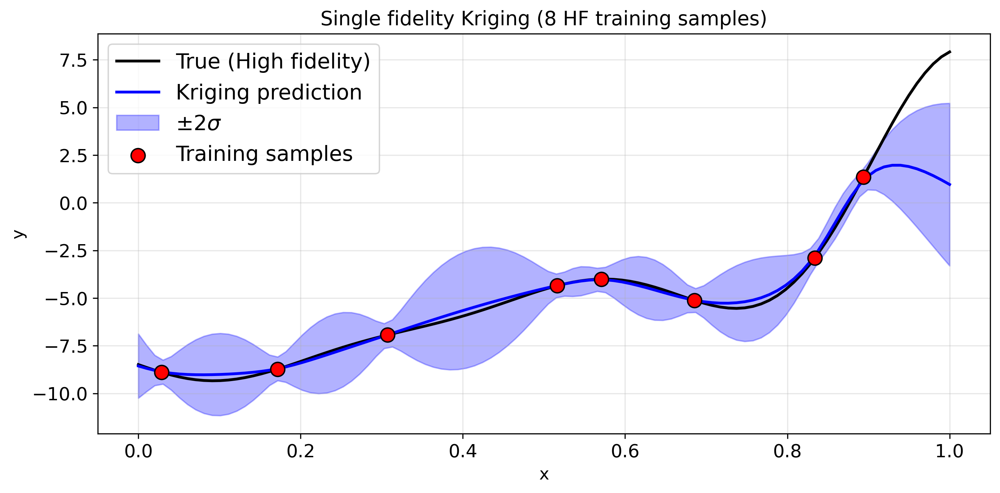
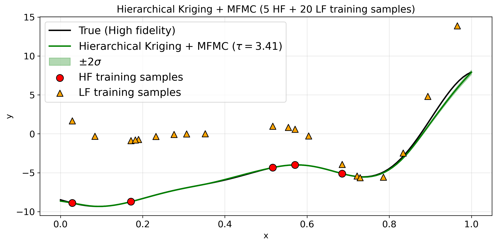

# Multifidelity Kriging with budget allocation
Hierarchical Kriging provides robust predictions by using both high and low fidelity data, but it does not specify how many samples of each fidelity should be used. This project addresses the limitation by proposing a multifidelity Monte Carlo (MFMC) budget allocation strategy for Hierarchical Kriging.

## To start
Run demo notebook `code/examples/demo.ipynb` to see performance of the proposed method. This example demonstrates Hierarchical Kriging with MFMC allocation on a 1D analytical function, compared to single fidelity Kriging.

## Key results
- Single-fidelity Kriging fails to capture the trend for $x > 0.8$, where no high fidelity samples are available.
- Hierarchical Kriging with MFMC allocation accurately predicts overall trend even in regions that lack high fidelity samples by leveraging low fidelity samples.

Figures below illustrate the predicted outputs for each method.

## More results
- See `code/examples` for further comparisons between MFMC allocation and naive allocation strategies.

Naive allocation assigns high- and low-fidelity samples using a fixed ratio

$$
\tau =
\frac{\text{number of low fidelity samples}}{\text{number of high fidelity samples}}
$$

We evaluate performance on:
- Ishigami function example (`ishigami`)
- Finite element simulation data of NASA CRM wing (`wing`)

MFMC allocation is compared against naive allocations with

$$
\tau = 2, 4, 8.
$$

### Prerequisites
1. Download data for the wing example.
* Download the wing structural stress data from [here](https://link.springer.com/article/10.1007/s00158-022-03274-1#Sec23) (3.9 GB) or by `wget https://static-content.springer.com/esm/art%3A10.1007%2Fs00158-022-03274-1/MediaObjects/158_2022_3274_MOESM1_ESM.zip`. Place the follwing data into `mfhikrig/data/wing`.
  1. `/data/crm_baseline_4DV_N1000_slim.h5`
  2. `/data/crm_coarse-grid_4DV_N1000_slim.h5`
  3. `/data/crm_coarse-ribs_4DV_N1000_slim.h5`

2. Preprocess the data
* For each example, run script beginning with `preproc_` to generate or format the data.

### Usage
Within each example folder, run `comparisonplot.py` to generate a relative error plot of HK with MFMC and naive allocations.
  * This script runs `errplot_mfmc` and `errplot_naive` in turn. Each of these script saves results in `npz` and these results will be loaded in `comparisonplot.py` to plot. If the `npz` files already exist, you can skip running these scripts by commenting out `import errplot_mfmc` and `import errplot_naive`
  * `errplot_mfmc`: trains HK model with MFMC allocation and computes the relative error. The results are saved in `npz`.
  * `errplot_naive`: trains HK model with naive allocations (using $\tau=2,4,8$) and computes the relative error. The results are saved in `npz`.
